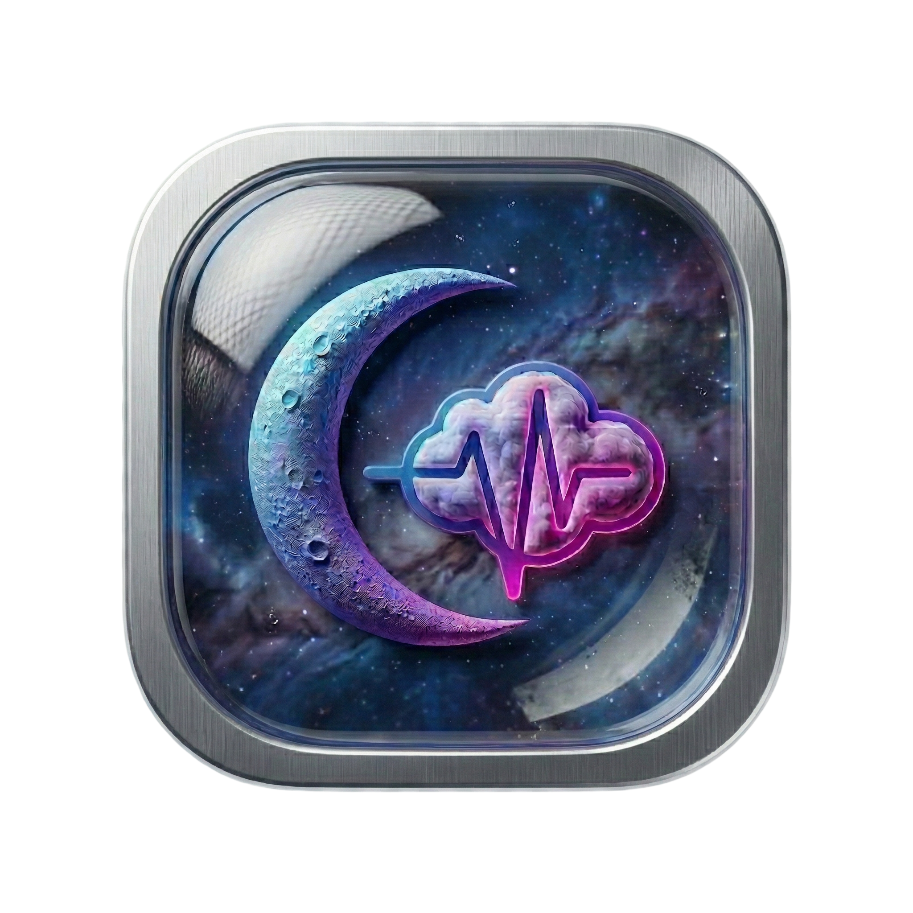
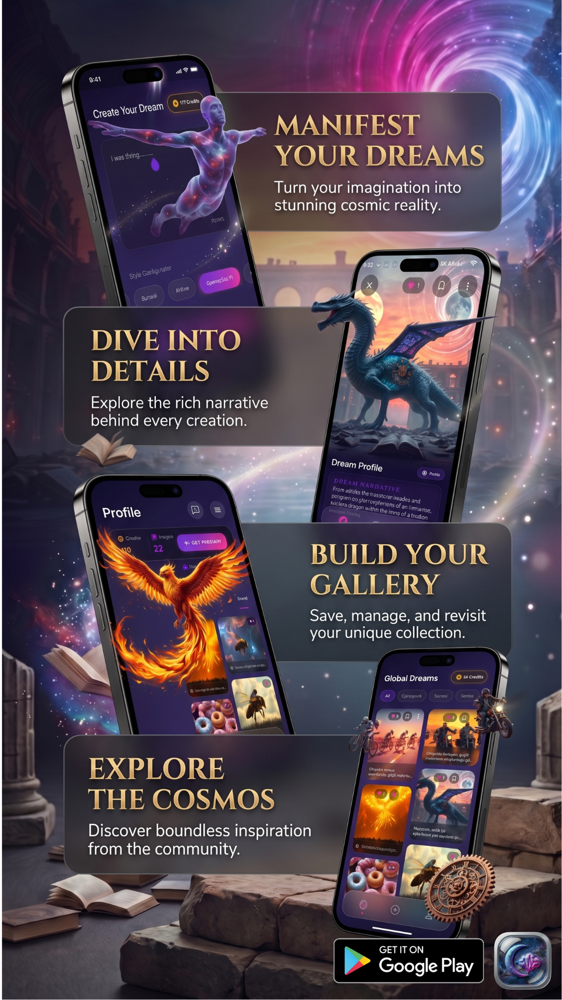
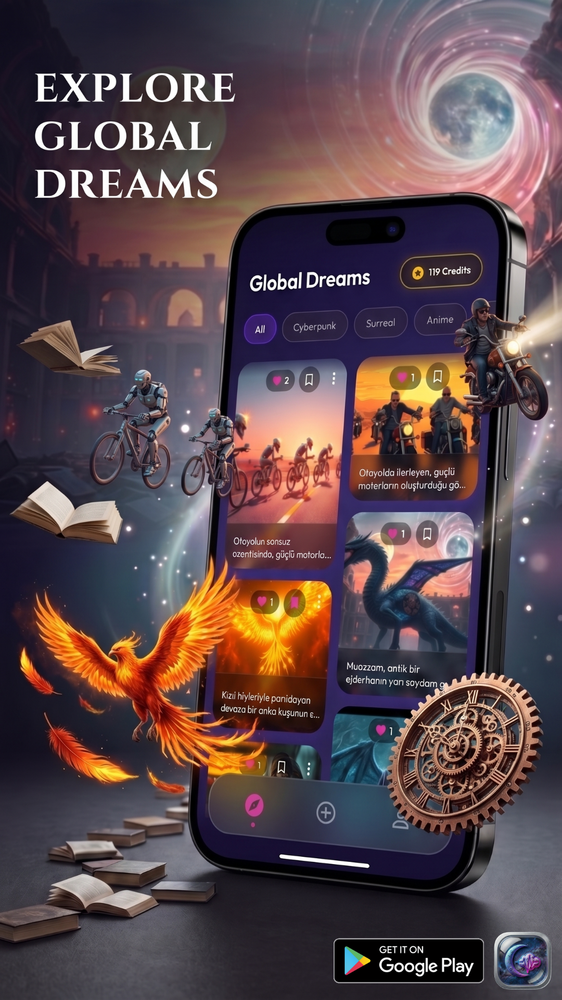
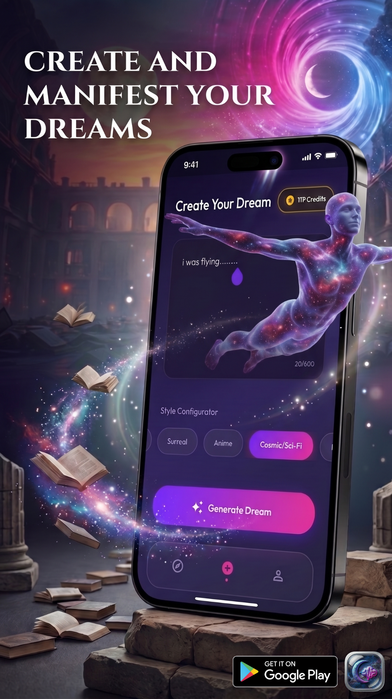
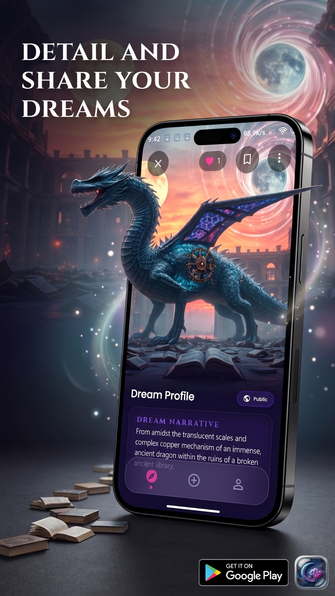
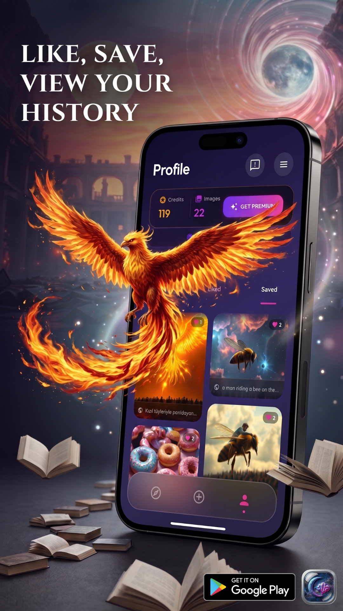

<div align="center">



# ✨ DreamApp

### *Where Artificial Intelligence Meets the Language of Dreams*

> An AI-powered mobile application that interprets your dreams through the lens of psychology, symbolism, and generative imagery — built on a production-grade, secure cloud architecture.

<br/>


</div>

---

## 📱 App Preview

<div align="center">
<table>
  <tr>
    <td align="center"><br/><sub><b>Welcome Screen</b></sub></td>
    <td align="center"><br/><sub><b>EXplore Screen</b></sub></td>
    <td align="center"><br/><sub><b>Dream Creation</b></sub></td>
    <td align="center"><br/><sub><b>AI Interpretation</b></sub></td>
    <td align="center"><br/><sub><b>Dream Gallery</b></sub></td>
  </tr>
</table>

<!-- Opsiyonel: Ekran kaydı GIF eklemek istersen -->
<!--  -->
</div>

---

## 🌟 Key Features

- **🤖 AI-Powered Dream Interpretation** — Leverages **Gemini 2.5 Flash** via structured JSON prompting to produce multi-layered psychological and symbolic interpretations, complete with Markdown-formatted emphasis on key insights.
- **🎨 Generative Dream Imagery** — Converts each dream narrative into a cinematic, anime, or artistic visual using the **FLUX.1 (fal.ai)** image generation model, driven by a style-aware prompt engineered on the server.
- **🔒 Secure Serverless AI Pipeline** — All AI API calls are executed exclusively within **Google Cloud Functions (Gen 2)**; no API key ever touches the client. Full authentication gating on every callable.
- **💳 Subscription & Credit System** — Seamlessly integrated with **RevenueCat** for cross-platform in-app purchases. Server-side webhook atomically credits user accounts on purchase and renewal events.
- **🛡️ Anti-Abuse & Device Integrity** — One-account-per-device enforcement via Firestore-transactional device fingerprinting. Protected by **Firebase App Check** to block non-genuine app traffic.
- **🌍 Multi-Language Support** — Full internationalization (`flutter_localizations`) with automatic response language matching the user's input language.
- **☁️ Real-time Cloud Sync** — All dreams, credits, and user state are persisted and synced in real-time through **Cloud Firestore**.
- **📲 Social Authentication** — Supports **Google Sign-In** and **Sign in with Apple** for frictionless onboarding.
- **💾 Save to Gallery** — Download generated dream imagery directly to the device gallery with a single tap.
- **🌌 Glassmorphism UI** — A premium, cosmic dark-mode interface built from the ground up with adaptive layouts supporting phones and tablets.

---

## 🏗️ Tech Stack & Architecture

### Architecture: Clean Architecture with Riverpod

DreamApp is built on **strict Clean Architecture**, partitioning every feature into three isolated layers:

| Layer | Responsibility | Key Packages |
|---|---|---|
| **Presentation** | UI widgets, state consumers, navigation | `flutter_riverpod`, `go_router`, `google_fonts`, `lottie` |
| **Application** | Business logic, use-case orchestration | `flutter_riverpod` (StateNotifiers / AsyncNotifiers) |
| **Data** | Repository implementations, remote & local data sources | `cloud_firestore`, `cloud_functions`, `firebase_auth`, `shared_preferences` |

This strict separation was a deliberate architectural decision for two key reasons:

1. **Scalability** — Each layer can evolve independently. Swapping the AI provider, changing the database, or redesigning the UI requires changes in exactly one layer without cascading side-effects across the codebase.
2. **Testability** — Business logic in the Application layer is entirely decoupled from Flutter widgets and Firebase SDKs. Repositories are abstracted behind interfaces, making them trivially mockable for unit and integration tests.

**Riverpod** was chosen over alternatives (Provider, BLoC) because its compile-time safety, auto-dispose lifecycle management, and first-class `AsyncValue` handling eliminate entire categories of runtime errors — particularly critical in an app with complex async AI pipelines and real-time credit state.

### Feature Modules

```
lib/
├── core/
│   ├── providers/       # Global app-level providers (locale, theme)
│   ├── services/        # Shared services (image download, etc.)
│   ├── utils/           # Helpers and extensions
│   ├── routing.dart     # GoRouter route definitions
│   ├── theme.dart       # Design system tokens
│   └── widgets.dart     # Shared UI components
├── features/
│   ├── auth/            # Authentication (Google, Apple, anonymous)
│   ├── create/          # Dream creation & AI pipeline
│   ├── dreams/          # Dream history & detail view
│   ├── explore/         # Public dream gallery
│   ├── premium/         # Subscription & paywall UI
│   ├── profile/         # User profile & settings
│   └── splash/          # Onboarding & splash logic
└── main.dart
```

### Cloud Functions (TypeScript / Node.js)

| Function | Trigger | Purpose |
|---|---|---|
| `processDreamAi` | `onCall` (Auth-gated) | Gemini 2.5 Flash prompt engineering → JSON interpretation |
| `generatedreamimage` | `onCall` (Auth-gated) | Transactional credit deduction → FLUX.1 image generation |
| `revenuecatwebhook` | `onRequest` (HTTP) | RevenueCat purchase/renewal → atomic Firestore credit increment |
| `checkdeviceaccountlimit` | `onCall` (Auth-gated) | Device fingerprint check to prevent multi-account abuse |
| `claimfreecredits` | `onCall` (Auth-gated) | One-time free credit grant per device (transactional) |
| `onusercreated` | Auth trigger | Bootstrap Firestore user document on registration |
| `onuserdeleted` | Auth trigger | Full data cleanup (user doc + all dreams) on account deletion |

---

## 🛡️ Security & Cloud Infrastructure

### AI Request Security Flow

```
┌─────────────────┐        ┌──────────────────────────┐        ┌─────────────────┐
│   Flutter App   │        │  Google Cloud Functions  │        │  Gemini / FAL   │
│                 │        │  (Secure Server Runtime) │        │  External APIs  │
│  Firebase Auth  │──JWT──▶│  • Verify Auth Token     │──Key──▶│                 │
│  App Check Token│──────▶ │  • Validate App Check    │        │  API key NEVER  │
│                 │        │  • Enforce credit quota  │        │  exposed to     │
│  [No API Keys]  │        │  • Run prompt engineering│        │  client device  │
└─────────────────┘        └──────────────────────────┘        └─────────────────┘
```

**API Key Isolation** — The Gemini API key and fal.ai key are stored exclusively in **Firebase Secret Manager** and injected at runtime into Cloud Functions via the `secrets` parameter. They are never bundled into the app binary and cannot be extracted through reverse engineering.

**Firebase App Check** — Every callable Cloud Function is protected by App Check, which cryptographically verifies that requests originate from a genuine, unmodified build of DreamApp. Spoofed clients, emulators, or reverse-engineered requests are rejected before any business logic executes.

**Firestore Security Rules** — Client-side Firestore access is governed by strict security rules. Administrative collections (`device_accounts`, `device_grants`) are entirely inaccessible to clients; they can only be written by the Admin SDK within Cloud Functions, making device-level anti-abuse guarantees tamper-proof.

**Transactional Credit Safety** — Credit deduction for image generation uses a Firestore **transaction** to atomically read, validate, and decrement the balance. If the downstream AI call fails, a compensating transaction issues an automatic refund — preventing any credit loss due to infrastructure errors.

---

## 🚀 Getting Started

### Prerequisites

- Flutter SDK `≥ 3.x` ([Install Flutter](https://docs.flutter.dev/get-started/install))
- Dart SDK `≥ 3.x`
- Firebase CLI (`npm install -g firebase-tools`)
- A Firebase project with Firestore, Auth, App Check, and Cloud Functions enabled
- Node.js `≥ 18` (for Cloud Functions)

### Installation

> 🔒 **Access Note:** The core source code repository is currently **Private** due to its active commercial status on the Google Play Store. The installation steps below are documented for authorized team members and internal CI/CD processes.

**1. Clone the repository**
```bash
git clone https://github.com/MehmetKaanTelli/DreamApp.git
cd DreamApp
```

**2. Configure Firebase**
```bash
# Install FlutterFire CLI
dart pub global activate flutterfire_cli

# Configure your Firebase project
flutterfire configure
```

This will generate `lib/firebase_options.dart` linked to your project.

**3. Install Flutter dependencies**
```bash
flutter pub get
```

**4. Configure environment secrets**

Store your API keys securely in Firebase Secret Manager (never in `.env` files committed to the repo):
```bash
# Set Gemini API key
firebase functions:secrets:set GEMINI_API_KEY

# Set fal.ai API key
firebase functions:secrets:set FAL_API_KEY
```

**5. Deploy Cloud Functions**
```bash
cd functions
npm install
cd ..
firebase deploy --only functions
```

**6. Run the app**
```bash
flutter run
```

### RevenueCat Setup

1. Create a project at [app.revenuecat.com](https://app.revenuecat.com)
2. Configure your Google Play / App Store products matching the product IDs in `CREDIT_MAP` inside `functions/src/index.ts`
3. Set up the RevenueCat Webhook pointing to your `revenuecatwebhook` Cloud Function URL
4. Add your RevenueCat API key to the Flutter app initialization

---

## 📦 Core Dependencies

| Package | Purpose |
|---|---|
| `flutter_riverpod` | Compile-safe reactive state management |
| `go_router` | Declarative, type-safe navigation |
| `firebase_auth` | Google & Apple authentication |
| `cloud_firestore` | Real-time NoSQL database |
| `cloud_functions` | Secure callable Cloud Functions client |
| `firebase_app_check` | Client integrity verification |
| `firebase_crashlytics` | Production crash reporting |
| `firebase_analytics` | User behavior analytics |
| `purchases_flutter` | RevenueCat in-app purchases |
| `google_sign_in` | Google OAuth 2.0 |
| `sign_in_with_apple` | Apple Sign-In |
| `cached_network_image` | Efficient image caching |
| `flutter_markdown` | Rendering AI-formatted interpretations |
| `lottie` | High-quality vector animations |
| `gal` | Save images to device gallery |
| `dio` | HTTP client for image downloading |
| `google_fonts` | Premium typography |
| `flutter_localizations` | i18n & l10n support |

---

## 📬 Contact

<div align="center">

**Mehmet Kaan Telli**
*Mobile Software Engineer*

[](https://www.linkedin.com/in/mehmet-kaan-telli-aa333b208)
[](https://github.com/Cyrxkaan)
[](mailto:official.kaan46@gmail.com)

</div>

---

<div align="center">

*Built with ❤️ and a deep curiosity about what happens when we close our eyes.*

**DreamApp** — *v1.0.1*

</div>
